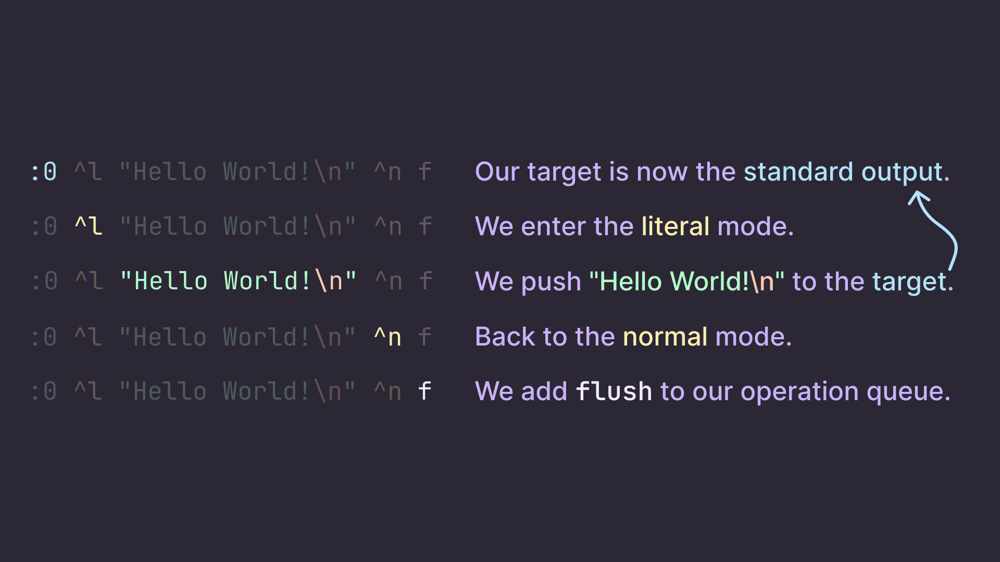

# Vism

Specification for the Vism esoteric programming language.

**Warning: it is not a definitive version and might change in the future.**

## Exisiting implementations

- [qexat/PyVism](https://github.com/qexat/pyvism)

## Introduction

**Vism** (IPA: `/vɪzᵊm/`) is an esoteric programming language mainly inspired from [Assembly](https://en.wikipedia.org/wiki/Assembly_language), [Brainfuck](https://en.wikipedia.org/wiki/Brainfuck) and, in a less linguistic and more technical aspect, the mode system of the text editor [Vim](<https://en.wikipedia.org/wiki/Vim_(text_editor)>).

In this regard, many concepts brought by the language might seem familiar to the reader who has an interest in those. For example, the memory scheme along with the few registers will most certainly delight the average [x86](https://en.wikipedia.org/wiki/X86_assembly_language) enjoyer ; the way to alternate between performing operations and writing values to memory is probably comparable respectively to the Normal and Insert mode of [Moolenaar](https://en.wikipedia.org/wiki/Bram_Moolenaar)'s software.

**If the reader got there, they should read [the rest of the specification](./spec/index.md)!**

