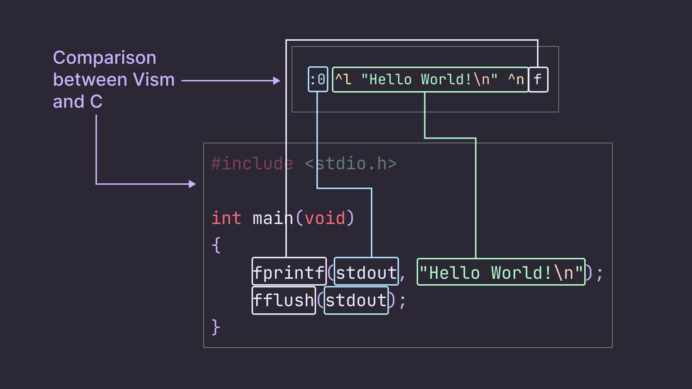

# Vism

## Introduction

**Vism** (IPA: `/vɪzᵊm/`) is an esoteric programming language mainly inspired from [Assembly](https://en.wikipedia.org/wiki/Assembly_language), [Brainfuck](https://en.wikipedia.org/wiki/Brainfuck) and, in a less linguistic and more technical aspect, the mode system of the text editor [Vim](<https://en.wikipedia.org/wiki/Vim_(text_editor)>).

In this regard, many concepts brought by the language might seem familiar to the reader who has an interest in those. For example, the memory scheme along with the few registers will most certainly delight the average [x86](https://en.wikipedia.org/wiki/X86_assembly_language) enjoyer ; the way to alternate between performing operations and writing values to memory is probably comparable respectively to the Normal and Insert mode of [Moolenaar](https://en.wikipedia.org/wiki/Bram_Moolenaar)'s software.

_- It's interesting, but now begs the question: what does a Vism program look like?_

## Hello World!

Let's start with the classic ["Hello World!" program](https://en.wikipedia.org/wiki/%22Hello,_World!%22_program):

```vism
:0 ^sHello World!\n^n f
```

Excuse the lack of syntax highlighting, Vism is not as popular as [Python](<https://en.wikipedia.org/wiki/Python_(programming_language)>) (hopefully, this sentence will be obsolete in the future!).

Here is the equivalent C program:

```c
#include <stdio.h>

int main(void)
{
    fprintf(stdout, "Hello World!\n");
    fflush(stdout);
}
```

Even better, a side-to-side comparison!



> For those who are interested, I made this design and the following ones in [Figma](https://figma.com) 😄

## Modes

As implied earlier, the main idea of Vism is alterning between operations and putting stuff in memory. For this to help, you have (as the time of writing) three modes:

-   `^n`: this is the mode by default. It allows performing operations.
-   `^s`: this is the string mode. It pushes the given string to a target specified beforehand.
-   `^l`: this is the literal mode. Similar to the string mode, but it supports a larger set of data types, such as integers, floats, booleans, [lists](https://en.wikipedia.org/wiki/Dynamic_array), and more!

_- What does "target specified beforehand" mean?_

## Targets

By default, all values you write in `^s` and `^l` go to the [null stream](https://en.wikipedia.org/wiki/Null_device), i.e. get discarded. If you want to save them somewhere, you need to specify a target.

There are three kinds of targets:

-   `&X`: represents a memory slot. It can store any type of value, but is [strongly typed](https://en.wikipedia.org/wiki/Strong_and_weak_typing): for example, if a string is assigned to the memory slot `&x`, then putting an integer thereafter will result in a compilation error.

-   `$X`: represents an address [register](https://en.wikipedia.org/wiki/Processor_register). The reader might compare it to a [pointer](<https://en.wikipedia.org/wiki/Pointer_(computer_programming)>), and would be correct ; it stores strings only, and these have to be a valid identifier.

-   `:X`: represents a stream. By default, `:0` and `:1` are respectively the [`stdout`](<https://en.wikipedia.org/wiki/Standard_streams#Standard_output_(stdout)>) and the [`stderr`](<https://en.wikipedia.org/wiki/Standard_streams#Standard_error_(stderr)>).

Alright, that's a lot to digest. Let's recap:


## Operations

To better understand the role of registers (see [targets](#targets)), we need to dig into the operations.

As the time of writing, the list of the existing operations in Vism goes as follows:

-   `+`: addition/concatenation.
-   `-`: substraction/substitution.
-   `×`: multiplication.
-   `/`: integer division.
-   `%`: modulo.
-   `÷`: divmod (a combination of integer division and modulo).
-   `p`: for printing a value.
-   `w`: to write to a given stream.
-   `f`: to flush a given stream.

The registers are used for the arguments of a chosen instruction.

> Technical note: they don't exist at runtime, since they are just here to determine an operation's operands at compilation.

Let's take the addition as an example. It is a binary operation, but Vism goes with three args with the first one being the target.
So, it will look at the registers `$0` (destination), `$1` (operand 1) and `$2` (operand 2). In those, it will find three identifiers (let's say we set them to `&x`, `&y` and `&z`), grab the value of the two last, add them together and put the result in the identifier corresponding to `$0`, here `&x`.

<!-- NEEDS UPDATE
 
-->

Here is an example:

```vism
&x ^l 0 ^n
&y ^l 34 ^n
&z ^l 35 ^n
$0 ^l "x" ^n
$1 ^l "y" ^n
$2 ^l "z" ^n
+
```

`&x` would equal `69` (nice).

More coming soon!
